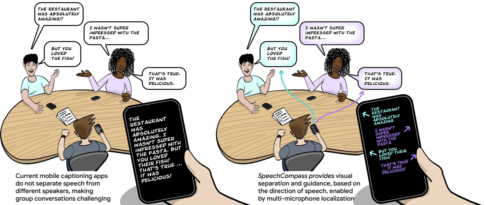
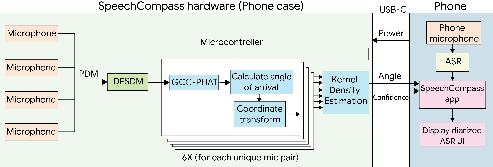

# SpeechCompass

[](https://dl.acm.org/doi/10.1145/3706598.3713631)
[](LICENSE)
[](https://arxiv.org/abs/2502.08848)

[Paper](https://arxiv.org/abs/2502.08848) | [ACM DL](https://dl.acm.org/doi/10.1145/3706598.3713631) | [Blog](https://research.google/blog/making-group-conversations-more-accessible-with-sound-localization/) | [Project Page](https://www.olwal.com/speechcompass)

Official code release for **SpeechCompass: Enhancing Mobile Captioning with Diarization and
Directional Guidance via Multi-Microphone Localization**, published at CHI 2025.



## Overview

SpeechCompass adds a spatial dimension to mobile speech-to-text by localizing speakers in
360° using a custom 4-microphone phone case. A lightweight C localization pipeline runs on
an embedded microcontroller, and an Android app displays directional captions with speaker
diarization — making group conversations more accessible for people who are hard of hearing.



## Repository Structure

| Component | Description |
|-----------|-------------|
| [`hardware/`](hardware/) | PCB schematics for the custom 4-microphone phone case |
| [`firmware/`](firmware/) | STM32 L5 microcontroller firmware (GCC-PHAT localization → USB output) |
| [`dsp/`](dsp/) | Platform-agnostic C localization and beamforming algorithms, with unit tests |
| [`android/`](android/) | Android Studio app (speech-to-text + directional visualization) |

Each component can be used independently — in particular, the DSP algorithms can be built
and tested with Bazel without any hardware.

## Citing this work

```
@inproceedings{dementyev2025speechcompass,
  title={SpeechCompass: Enhancing Mobile Captioning with Diarization and Directional Guidance via Multi-Microphone Localization},
  author={Dementyev, Artem and Kanevsky, Dimitri and Yang, Samuel and Parvaix, Mathieu and Lai, Chiong and Olwal, Alex},
  booktitle={Proceedings of the 2025 CHI Conference on Human Factors in Computing Systems},
  year={2025}
}
```

## License and disclaimer

Copyright 2025 Google LLC

All software is licensed under the Apache License, Version 2.0 (Apache 2.0);
you may not use this file except in compliance with the Apache 2.0 license.
You may obtain a copy of the Apache 2.0 license at:
https://www.apache.org/licenses/LICENSE-2.0

All other materials are licensed under the Creative Commons Attribution 4.0
International License (CC-BY). You may obtain a copy of the CC-BY license at:
https://creativecommons.org/licenses/by/4.0/legalcode

Unless required by applicable law or agreed to in writing, all software and
materials distributed here under the Apache 2.0 or CC-BY licenses are
distributed on an "AS IS" BASIS, WITHOUT WARRANTIES OR CONDITIONS OF ANY KIND,
either express or implied. See the licenses for the specific language governing
permissions and limitations under those licenses.

This is not an official Google product.
