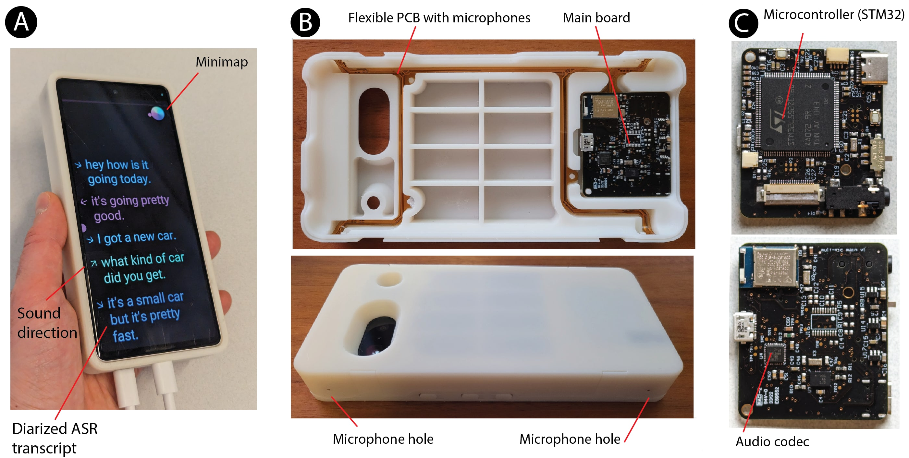
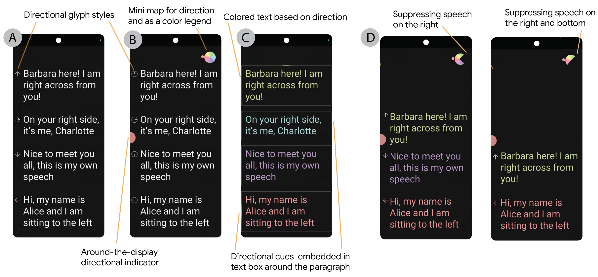

# SpeechCompass

(This is not an officially supported Google product.)

SpeechCompass is a real-time, multi-microphone speech localization,
visualization, and diarization platform. We believe that adding a spatial
dimension to sound understanding can greatly improve the usability of audio
interfaces. For more details see our publication in
[CHI'25](https://arxiv.org/pdf/2502.08848)

[TOC]

## Multi microphone phone case design

To allow experimentation, we designed a custom hardware phone case with embedded
four microphones. The localization data is sent from the phone case to the phone
over USB.

## Lightweight localization and beamforming

We implement localization and beamforming algorithms capable of running in
real-time on low-power microcontroller.

## Android visualization application

The ASR and visualizations runs as an app on the phone. It actually uses phone
microphone for the ASR and receives the sound direction from the phone case over
USB. 

## License

This code uses the Apache License 2.0. See the
[LICENSE](/third_party/deepmind/speech_compass/LICENSE) file for details.

## Documentation

*   [Hardware](/third_party/deepmind/speech_compass/docs/hardware/index.md)
*   [Firmware](/third_party/deepmind/speech_compass/docs/firmware/index.md)
*   [Android application](/third_party/deepmind/speech_compass/docs/android/index.md)
*   [DSP algorithms](/third_party/deepmind/speech_compass/docs/algorithms/index.md)
